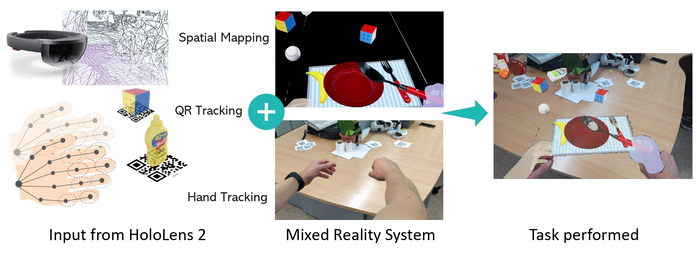

# HoloDemtect
## A mixed reality framework for cognitive stimulation through interaction with objects

[](https://img.shields.io/badge/UnrealEngine-4.27-green?style=flat-square)


In this work, we propose a system for the evaluation of potential signs of dementia. To this end, we have defined three groups of tasks that stimulate mental and motor abilities of the users. The application is divided into two phases, in the first one the supervisor of the system sets up the environment by selecting the task and spawning the necessary objects with the help of QR codes. In the second one, the user performs the tasks while an evaluation is carried out by the supervisor and the system, by actively collecting data from the user's actions.



We have distinguished three groups of tasks based on how they are completed: 
- Sequential tasks, which evaluate the user's memory and motor skills are evaluated by assessing their ability to keep track of a list of objects. An example of such a task is do the shopping given a list.
- Semantic pair matching tasks, in which the available objects have to be grouped into pairs, taking into account the semantic and contextual relationship that the objects have with each other.
- Logical organisation tasks, in which the user has to place the objects according to a given set of instructions or social conventions. For example, the user has to arrange the table with the appropriate virtual objects.


## How to use  

First, install Unreal Engine 4, version 2.27 or upper.

```bash
# clone project   
git clone https://github.com/3dperceptionlab/HoloDemtect.git
```

There are two ways to run the AR application:

- **Run the application on our PC**: Open the UE4 project and connect the HoloLens to Unreal using the Holographic Remoting Player app on the HoloLens. This requires the Hololens plugin to be installed in Unreal. Then go to Project Settings > Platforms > Windows Mixed Reality and connect the device by setting its IP.

- **Deploy the application to the HoloLens headset**: To deploy to the device, build and upload the package (.appxbundle and select "Allow me to select framework packages" and upload the .appx file) to the Mixed Reality Portal.
If this is your first time, you will need to generate a key. To do this in UE4, go to Edit>Project Settings>Platform>HoloLens, in Packaging/Signing Certificate: Generate New.

## Posible building errors

> #### Not found some asset while building
>
> - Check the files in `ProjectFolder > Saved > Cooked` 
>

> #### Failed to build "Saved\UATTempProj.proj":
>
> - Recompile (not just compile) AutomationTool Visual Studio project
> 


## Source Code Architecture

### Core Classes

#### Data Generation and API Connection

**DatasetGenerator** (`DatasetGenerator.h/cpp`)
- **Purpose**: Manages data collection and transmission to the Flask API server for evaluation analysis
- **Key Features**:
  - Collects time-series data during task execution including hand positions, rotations, head tracking, eye tracking, and grasping events
  - Captures screenshots at each data point for visual analysis
  - Sends data via HTTP POST requests to the API server (`http://clarke:5000`)
  - Implements multipart/form-data encoding for sending combined text and image data
- **Data Structure**: `FTimeseriesRow` contains:
  - Timestamp, hand positions/rotations (left/right)
  - Head position/rotation, eye tracker position/direction
  - Object grasp status, error counts
- **API Endpoints**:
  - `/time_series`: Sends individual time-series rows with accompanying images
  - `/summary`: Sends task summary with completion metrics
- **Thread Safety**: Uses semaphore to control sequential data transmission

**Task System** (`Task.h/cpp`)
- **Purpose**: Abstract base class for all cognitive evaluation tasks
- **Key Features**:
  - Loads task configurations from JSON files (`Content/JSONDicts/tasks.json`)
  - Evaluates object placement within designated evaluation zones using bounding boxes
  - Tracks errors and validates task completion
  - Dynamic class loading using Unreal's reflection system
- **Task Types**:
  - **ShoppingTask** (`ShoppingTask.h/cpp`): Sequential memory task requiring users to collect items from a shopping list
  - **LayTableTask** (`LayTableTask.h/cpp`): Logical organization task for table setting according to social conventions
  - **PairMatchingTask** (`PairMatchingTask.h/cpp`): Semantic matching task requiring users to pair related objects

#### Object Management

**GraspingObject** (`GraspingObject.h/cpp`)
- **Purpose**: Represents interactive virtual objects that users can manipulate
- **Key Features**:
  - Implements grab and release mechanics with physics simulation
  - Spawns objects based on QR code detection with appropriate scale, position, and rotation
  - Configurable as movable or fixed objects
  - Tracks grab state for data generation


#### User Interface

**TaskMenu** (`TaskMenu.h`)
- **Purpose**: Widget for task selection interface
- **Key Features**:
  - Dynamically generates buttons from task definitions
  - Broadcasts task selection events to game logic
  - Integrates with Unreal's UMG system

### API Connection Flow

1. **Task Initialization**: System loads tasks and objects from JSON files
2. **QR Detection**: QR codes spawn objects and evaluation points in the environment
3. **Data Collection**: `DatasetGenerator` continuously records user interactions during task execution
4. **Data Transmission**: Time-series data sent incrementally to Flask API server with images
5. **Task Completion**: Summary statistics sent to API for permanent storage
6. **Data Storage**: API server stores individual time-series CSV files per session and cumulative summary

The Flask API (`HoloDemTectAPI/main.py`) provides REST endpoints for receiving evaluation data, organizing it into time-series files and summary statistics for later analysis.

## Authors

This project has been carried out by:
- David Mulero-Perez ([dmulero@dtic.ua.es](mailto:dmulero@dtic.ua.es))
- Manuel Benavent-Lledo ([mbenavent@dtic.ua.es](mailto:mbenavent@dtic.ua.es))
